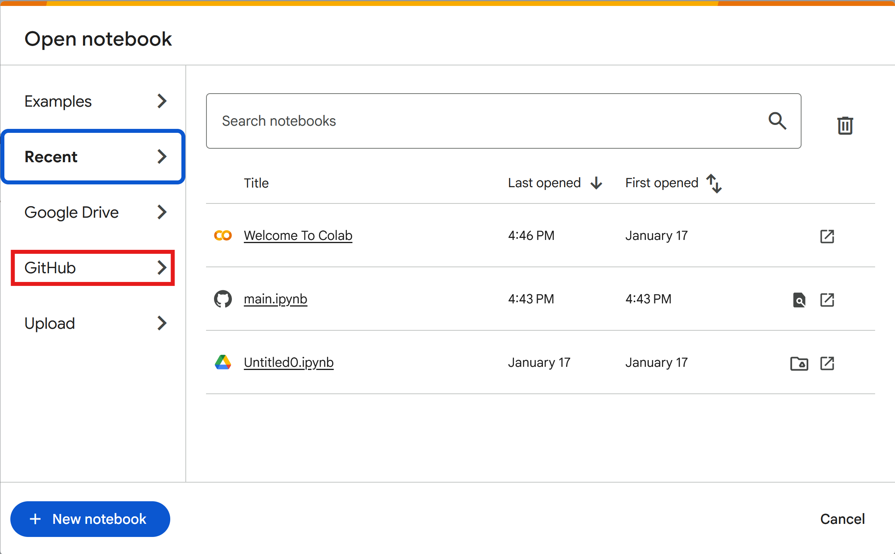
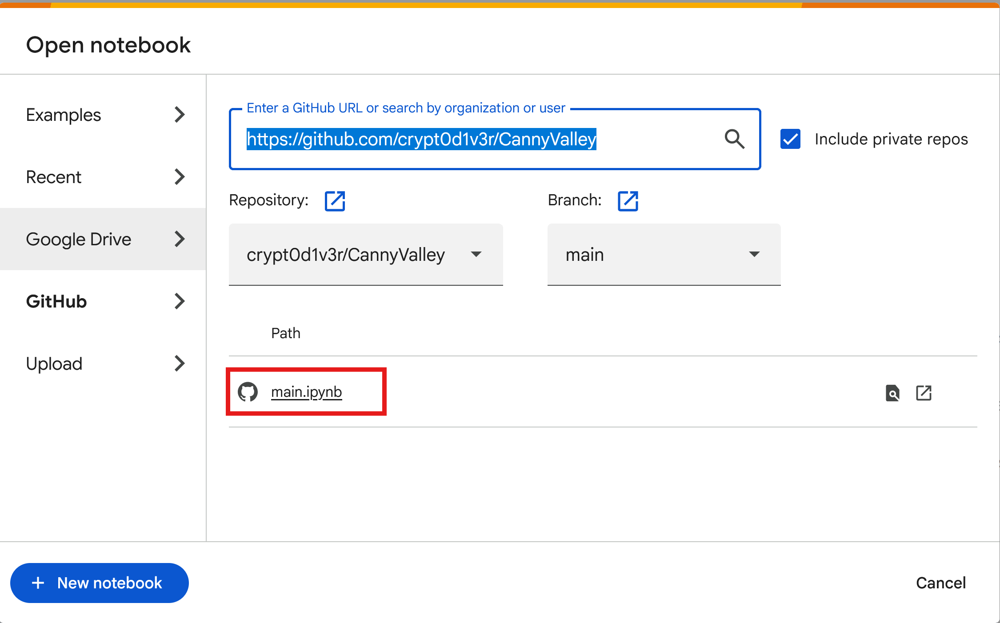

# Getting Started with Google Colab
1. Navigate to https://colab.research.google.com/
2. Select the option to "Open Notebook"
3. Select the "GitHub" tab as indicated in the image below:

4. Enter the repository URL: https://github.com/crypt0d1v3r/CannyValley
5. Select the branch: main (or a feature branch if you are working on one)
6. Select the notebook: main.ipynb as indicated in the image below:

7. Click "Open"
8. Remember to save and commit your changes to GitHub by clicking the File > Save button in the top right corner of the notebook.
9. You can also manually clone the repo and open the notebook in Jupyter Notebook locally (assuming you've installed Anaconda).